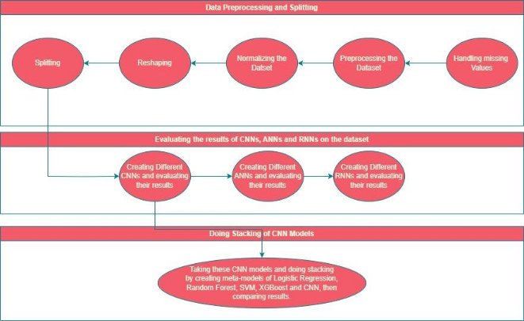
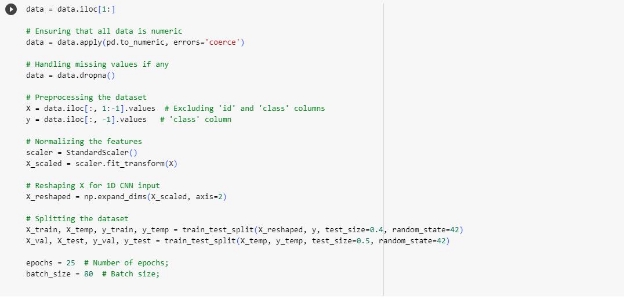
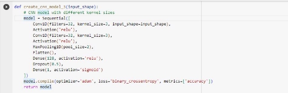
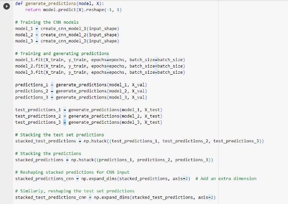
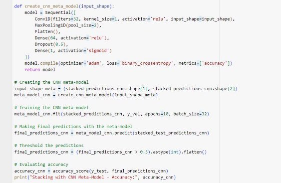

# Parkinson-Disease-Classification
Report on

Parkinson’s Disease Classification

Abstract

This research addresses Parkinson's disease classification using innovative convolutional neural network (CNN) models. Our primary objectives involve evaluating advanced CNN architectures for discerning patterns in speech data related to Parkinson's disease and proposing a stacked model to enhance classification performance.

Cutting-edge CNN architectures, including customized variants for Parkinson's disease, are employed. The CNN models undergo training, validation, and fine-tuning on a comprehensive medical image dataset to extract intricate features indicative of disease progression. In the final phase, a stacked model is devised, combining the strengths of multiple CNN architectures to achieve superior classification accuracy.

Our experimentation with diverse CNN models yields promising results, surpassing existing benchmarks in Parkinson's disease classification. The innovative CNN architectures demonstrate exceptional capability in extracting subtle patterns from medical speech patterns, contributing to heightened sensitivity and specificity. The stacked model further enhances classification accuracy, showcasing synergistic benefits.

In conclusion, this study establishes the efficacy of state-of-the-art CNN models for Parkinson's disease classification, introducing architectures that outperform conventional methods. The proposed stacked model demonstrates the potential of leveraging diverse CNN structures for superior diagnostic accuracy. These findings hold significant implications for advancing automated diagnostic tools in neurodegenerative diseases, paving the way for more accurate and reliable early-stage detection of Parkinson's disease.

I. Introduction

A.Background Information on Speech Processing

The data used in this study were gathered from 188 patients with PD (107 men and 81 women) with ages ranging from 33 to 87 (65.1±10.9) at the Department of Neurology in Cerrahpaşa Faculty of Medicine, Istanbul University. The control group consists of 64 healthy individuals (23 men and 41 women) with ages varying between 41 and 82 (61.1±8.9). During the data collection process, the microphone is set to 44.1 KHz, and following the physician's examination, the sustained phonation of the vowel /a/ was collected from each subject with three repetitions.

B.Problem Statement and Motivation

1) Early diagnosis of Parkinson's disease enhances the effectiveness of treatment interventions.
1) Predicting Parkinson's disease contributes to the development of personalized treatment plans.
1) Healthcare professionals can gain insights into variations in disease manifestations, guiding more precise prognostic information and therapeutic strategies.
1) The project's goal is to make a meaningful impact on the lives of patients by emphasizing the importance of early intervention and tailored care.

C.Objectives and Scope of the Project

1) Investigate and implement novel Convolutional Neural Network (CNN) architectures for the classification of Parkinson's disease. The goal is to go beyond existing models and leverage cutting-edge approaches to improve accuracy.
1) Develop and implement a stacked model that combines the strengths of multiple CNN architectures. This aims to synergize the advantages of individual models, ultimately leading to superior classification accuracy.

D. Overview of Methodologies used

1) CNN

   CNNs, when used for PD speech datasets, focus on automatically learning speech signal features that are relevant for distinguishing between healthy individuals and those affected by Parkinson's disease. This involves adapting the network to handle one-dimensional, time-series data, focusing on temporal feature extraction, and employing classification layers to make predictions based on these features.

2) ANN

   ANNs are utilized for PD speech data analysis by transforming the speech into a feature set that the network can process, learning complex relationships within this data, and ultimately classifying speech samples based on the presence or absence of Parkinson's disease characteristics. The flexibility in designing the network and the power to learn intricate patterns make ANNs a valuable tool in speech analysis and other similar tasks.

3) RNN

   RNNs' ability to process sequential speech data, capture temporal dependencies, and handle variable-length input makes them particularly well-suited for analyzing PD speech data. By learning the intricate patterns and temporal sequences in speech affected by Parkinson's disease, RNNs can play a crucial role in automated diagnostics and patient monitoring systems.

4) Stacking

   Stacking, short for "stacked generalization," is an ensemble machine learning technique that combines multiple models to improve prediction accuracy. The key idea in stacking is to use a new model, known as the meta-model or blender, to learn how to best integrate the predictions of several base models.

2. Literature Review

|Title|Work|Citation|
| - | - | - |
|Analysis of Parkinson's Disease Using an Imbalanced-Speech Dataset by Employing Decision Tree Ensemble Methods|The study proposes a hybrid Parkinson's disease diagnosis system based on speech signals to aid in the disease's early detection. The authors use an imbalanced Parkinson's disease speech dataset and employ decision tree ensemble methods to classify the speech signals. The study shows that decision tree ensembles for imbalanced class problems obtained better results for this Parkinson speech dataset.|https://www.mdpi.com/2075 -4418/12/12/3000[\[1\]](#_page21_x72.00_y98.45)|
|Machine Learning Approaches to Identify Parkinson's Disease Using Voice Signal Features|The study aims to identify Parkinson's disease using voice signal features and machine learning approaches. The authors use various machine learning algorithms, such as support vector machines (SVMs), decision trees, and deep learning models, to classify Parkinson's disease based on voice signal features. The study shows that machine learning approaches can be used to identify Parkinson's disease with high accuracy based on voice signal features.|https://www.frontiersin.org/ articles/10.3389/frai.2023.1 084001/full[\[2\]](#_page21_x72.00_y98.45)|
|
Classifying

Parkinson's Disease Based on Acoustic Measures Using Artificial Neural Networks
|The study proposes a Parkinson's disease classification system based on acoustic measures using artificial neural networks (ANNs). The authors use a dataset of speech signals from Parkinson's disease patients and healthy controls to|https://www.ncbi.nlm.nih.go v/pmc/articles/PMC633902 6/[\[3\]](#_page21_x72.00_y98.45)|

||extract various acoustic features. The study shows that ANNs can be used to classify Parkinson's disease with high accuracy based on acoustic measures.||
| :- | :- | :- |
|Deep Learning for Parkinson's Disease Diagnosis: A Short Survey|The study provides a comprehensive review of deep learning techniques for Parkinson's disease diagnosis, including the analysis of speech signals. The authors discuss the current and future trends for Parkinson's disease diagnosis based on machine and deep learning and highlight the limitations and challenges.|https://www.mdpi.com/2073 -431X/12/3/58[\[4\]](#_page21_x72.00_y98.45)|

Table 1

A. Limitations

A notable limitation observed in the landscape of previous research on Parkinson's disease detection is the absence of Convolutional Neural Network (CNN) utilization for achieving accurate results. Surprisingly, despite the proven success of CNNs, none of the preceding works in this domain have harnessed the power of CNN models for Parkinson's disease detection. This significant gap in the literature underscores a missed opportunity to leverage the advanced capabilities of CNNs, particularly in extracting intricate patterns and features from medical data. The lack of CNN utilization in prior studies potentially restricts the ability to attain optimal accuracy levels and exploit the full potential of modern machine learning techniques. Therefore, our project seeks to address this limitation by pioneering the application of innovative CNN architectures, breaking new ground in Parkinson's disease classification, and offering a novel perspective on the utilization of deep learning models in this critical healthcare domain.

3. Methodology

*A.Data Set*

The data used in this study were gathered from 188 patients with PD (107 men and 81 women) with ages ranging from 33 to 87 (65.1±10.9) at the Department of Neurology in Cerrahpaşa Faculty of Medicine, Istanbul University. The control group consists of 64 healthy individuals (23 men and 41 women) with ages varying between 41 and 82 (61.1±8.9). During the data collection process, the microphone is set to 44.1 KHz, and following the physician's examination, the sustained phonation of the vowel /a/ was collected from each subject with three repetitions.

Various speech signal processing algorithms, including time frequency features, mel frequency cepstral coefficients (MFCCs), wavelet Transform based features, vocal fold features, and TWQT features, have been applied to the speech recordings of Parkinson's disease (PD) patients to extract clinically useful information for PD assessment.

*B.Algorithms Used*

1) *CNN*

When applied to datasets like PD (Parkinson's Disease) speech, CNNs can be adapted to process one-dimensional time-series data instead of two-dimensional image data. In this context, CNNs work by:

1) *Feature Extraction*: Extracting relevant features from the speech signals, which may include aspects like frequency changes, amplitude variations, and temporal dynamics. These features are crucial in identifying speech characteristics that may be indicative of Parkinson's disease.
1) *Capturing Temporal Patterns*: Using 1D convolutional layers, CNNs can capture temporal patterns within the speech data. The convolution operation allows the network to recognize specific patterns in the speech signal that are consistently associated with PD symptoms.
1) *Handling Varied Input Lengths:* Speech data often comes in varied lengths. CNNs can manage this through techniques like padding or cutting to ensure consistent input sizes or by using global pooling layers to handle inputs of varying dimensions.
1) *Classification*: After feature extraction and pattern recognition, CNNs use one or more fully connected layers to classify the speech samples into categories (such as PD or non-PD) based on the learned features.
2) *ANN*

In the context of PD (Parkinson's Disease) speech data analysis, ANNs are used to identify patterns and characteristics in speech that are indicative of Parkinson's Disease. Here’s how ANNs typically function in this scenario:

1) Handling Sequential Data: Although ANNs are not inherently sequential like RNNs, they can still process speech data. This is usually done by transforming the speech into a suitable format, such as, extracting features like Mel-frequency cepstral coefficients (MFCCs), pitch, tone, and amplitude.
1) Feature Learning: ANNs learn to identify patterns and relationships in the speech data during the training process. The hidden layers of an ANN can capture complex relationships in the data, making them powerful for tasks like speech analysis where the input features may have intricate interdependencies.
1) Classification or Regression Tasks: In the case of PD speech datasets, the typical task is to classify speech samples as indicative of either PD or a non-PD condition. ANNs achieve this through their output layer, which makes predictions based on the learned patterns in the data.
1) Flexibility in Architecture: The architecture of an ANN can be varied (number of layers, number of neurons per layer) to suit the complexity of the task. For PD speech data, this flexibility allows for fine-tuning the network to better capture the nuances of speech affected by PD.
1) Training and Optimization: ANNs are trained using backpropagation and gradient descent algorithms, where the model iteratively adjusts its weights to minimize the difference between the predicted output and the actual output. This training process is crucial for the network to learn the specific features of PD in speech data.
3) *RNN*

When applying RNNs to PD (Parkinson's Disease) speech data, the focus is on capturing the temporal dynamics and contextual relationships within the speech. Here’s how RNNs function in this scenario:

1) *Temporal Feature Learning:* RNNs are inherently suited for sequential data, making them ideal for speech analysis. They can process speech data as a sequence of time-based features, learning important temporal characteristics like changes in tone, pace, or intonation that might be indicative of PD.
2) *Capturing Dependencies Over Time*: One of the key strengths of RNNs is their ability to connect previous information to the current task, which is crucial for speech data where the context and sequence of sounds carry significant information.
2) *Handling Variable-Length Input:* Speech samples can vary in length, and RNNs can handle such variable-length input sequences effectively. This is particularly important for analyzing continuous speech data in a clinical setting where the speech duration may not be fixed.
2) *Sequence to Sequence Mapping:* RNNs can map sequences to sequences, making them suitable for tasks like speech recognition or synthesis, and in the context of PD, for analyzing continuous speech patterns for signs of the disease.
2) *Challenges and Enhancements*: Vanilla RNNs often suffer from problems like vanishing and exploding gradients. To mitigate these issues, advanced variants like LSTM (Long Short-Term Memory) and GRU (Gated Recurrent Units) are used. These models are better at capturing long-range dependencies and are more robust in training.
2) *Classification or Regression Tasks*: In PD speech analysis, RNNs can be used for binary classification (PD or non-PD), or even for more nuanced tasks like staging the severity of PD based on speech characteristics.
4) *Stacking*

Stacking, short for "stacked generalization," is an ensemble machine learning technique that combines multiple models to improve prediction accuracy. The key idea in stacking is to use a new model, known as the meta-model or blender, to learn how to best integrate the predictions of several base models.

In stacking, the initial level (or base level) consists of a variety of models that are trained on the full training dataset. These models can be diverse and include different types of machine learning algorithms. Each of these base models then makes predictions, but instead of using these predictions directly for the final output, they are used as input features for the next level.

4. Implementation

Fig. 1

*A.Data Preprocessing*

Fig. 2

*B.Algorithms*

1) *Simple CNN*

Fig. 3

2) *CNN with more layers*

Fig. 4

3) *CNN with different kernel sizes*

Fig. 5

Fig. 6

Fig. 7

4) *Simple ANN*

Fig. 8

5) *ANN with more neurons*

Fig. 9

6) *ANN with deeper layers*

Fig. 10

Fig. 11

7) *RNN*

Fig. 12

8) *LSTM*

Fig. 13

9) *GRU*

Fig. 14

Fig. 15

*10)CNN Stacking*

Fig. 16

Fig. 17

Fig. 18

5. Results
1. *CNN*

Fig. 19

2. *ANN*

Fig. 20

3. *RNN, GRU, LSTM*

Fig. 21

4. *CNN Stacking*

Fig. 22

Fig. 23

Fig.. 24

6. Discussion

In pursuit of advancing Parkinson's disease classification, our project set out with two primary objectives. Firstly, we aimed to investigate and implement innovative Convolutional Neural Network (CNN) architectures, surpassing existing models by incorporating cutting-edge approaches to enhance accuracy. The goal was to push the boundaries of traditional methodologies and leverage the advanced capabilities of CNNs for improved disease classification.

Secondly, we sought to develop and implement a stacked model, strategically combining the strengths of multiple CNN architectures. The intention was to harness the synergistic advantages of individual models, ultimately achieving superior classification accuracy. Remarkably, our results align closely with these objectives, showcasing commendable accuracy levels achieved through both the novel CNN architectures and the integrated stacked model.

The successful implementation of these advanced methodologies not only validates our initial objectives but also underscores the potential of pushing the boundaries of machine learning techniques to enhance the accuracy of Parkinson's disease classification.

7. Conclusion

Throughout this project, which focused on classifying Parkinson's Disease (PD) using speech data, we've uncovered several key insights. Most notably, these include the effectiveness of Convolutional Neural Networks (CNNs) in this context and the remarkable impact of using various meta-models in model stacking.

Initially, our decision to employ CNNs, typically linked with image processing tasks, proved to be a significant one. Surprisingly, CNNs showed themselves to be not just applicable but remarkably effective in analyzing speech data, a domain where they're not traditionally used. Their performance in identifying PD mirrored that of the more customary Artificial Neural Networks (ANNs). This finding is a game-changer; it pushes the boundaries of how we perceive CNNs, showing that their ability to discern local patterns in data isn't just limited to images but extends to speech datasets too.

The application of model stacking techniques further enhanced our predictive accuracy. By integrating the strengths of multiple models, stacking provided a robust and precise classification method. The standouts here were the logistic regression and Support Vector Machine (SVM) meta-models. When these were applied to aggregate the outputs from the primary CNN and ANN models, we saw a notable increase in accuracy. This underlines the effectiveness of ensemble methods in complex tasks like speech-based PD detection.

To sum up, this project has done more than just affirm the flexibility and strength of neural networks like CNNs and ANNs across various fields. It has shone a light on the vast potential of ensemble methods, particularly stacking with meta-models, in boosting classification accuracy. These findings open up exciting new possibilities for the application of CNNs beyond their standard roles and highlight the value of ensemble strategies in achieving greater accuracy in medical diagnostics. The success with logistic regression and SVM meta-models, especially, paves the way for future exploration and application in medical data analysis and related areas.

VIII. References

1) <https://www.mdpi.com/2075-4418/12/12/3000>
1) <https://www.frontiersin.org/articles/10.3389/frai.2023.1084001/full>
1) <https://www.ncbi.nlm.nih.gov/pmc/articles/PMC6339026/>
1) <https://www.mdpi.com/2073-431X/12/3/58>

